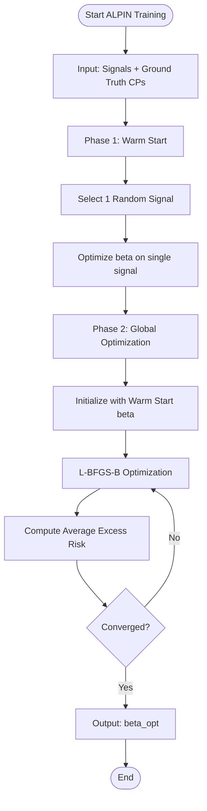

# ALPIN Algorithm

The **ALPIN** (Adaptive Learning of Penalty for INference) algorithm is designed to automatically learn the optimal penalty parameter $\beta$ for changepoint detection in piecewise-constant signals.

## Problem Formulation

Given a signal $y$ and a partition $A$, the penalized risk is defined as:
$$R_\beta(y, A) = R(y, A) + \beta |A|$$
where $R(y, A)$ is the empirical quadratic risk (sum of squared residuals) and $|A|$ is the number of segments.

The goal is to find $\beta$ such that the $\beta$-optimal partition:
$$\hat{A}(\beta) = \arg\min_A R_\beta(y, A)$$
best matches the ground truth partition $A^{lab}$.

## Algorithm Flow

The learning process minimizes the **Average Excess Risk** across $N$ training signals:
$$\min_\beta \frac{1}{N} \sum_{i=1}^N E(y_i, \beta)$$
where $E(y, \beta) = R_\beta(y, A^{lab}) - R_\beta(y, \hat{A}(\beta))$.

## Implementation Details

- **Optimization**: Uses `scipy.optimize.minimize` with the `L-BFGS-B` method.
- **Search Space**: Optimization is performed in the log-domain ($\log \beta$) to ensure positivity and handle large ranges.
- **Solver**: Uses the [[Algorithms/Optimal-Partition|Pelt algorithm]] to find $\hat{A}(\beta)$ at each iteration.

## Key Features

- **Supervised**: Requires labeled data but eliminates manual tuning.
- **Robust**: Minimizing excess risk directly targets the alignment with human annotations.
- **Adaptive**: Learns different $\beta$ values for different annotation protocols (e.g., Protocol I vs Protocol II).

## References
- [[Modules/Core-ALPIN|Core ALPIN Module]]
- [[Algorithms/Risk-Minimization|Risk Minimization Details]]
