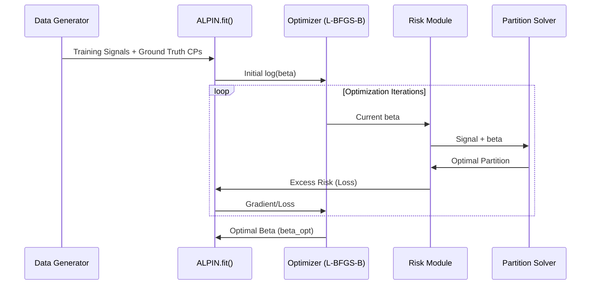
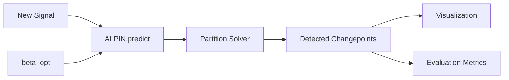
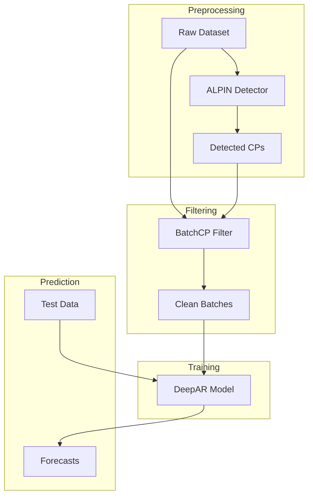

# Data Flow

This document illustrates how data moves through the ALPIN system, from generation to evaluation.

## Training Data Flow

The training process learns the optimal penalty parameter $\beta$ from labeled signals.

## Inference Data Flow

Once trained, ALPIN can detect changepoints in new, unlabeled signals.

## DeepCAR Forecasting Data Flow

In the DeepCAR experiment, ALPIN is used as a preprocessing step to filter training data for a DeepAR model.

## Data Formats

- **Signals**: 1D `numpy.ndarray` of floats.
- **Changepoints**: `list[int]` containing 0-indexed sample positions.
- **DeepAR Data**: `pandas.DataFrame` with `time_idx`, `series_id`, and `value` columns.
