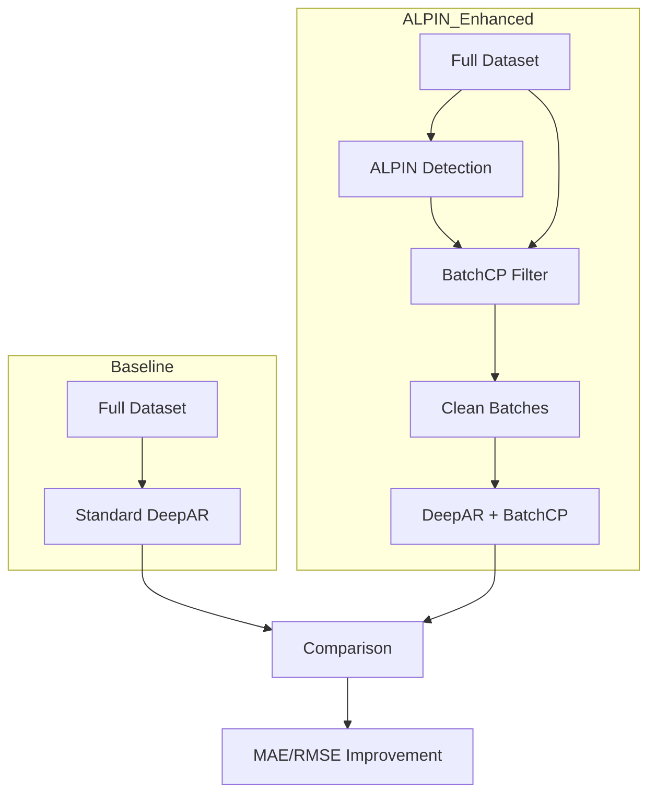

# DeepCAR Architecture

The **DeepCAR** (Changepoint-Aware DeepAR) experiment demonstrates the practical utility of ALPIN in improving time series forecasting.

## The Problem: Contaminated Batches

Standard DeepAR training uses sliding windows (batches) to train the LSTM. Some of these windows inevitably span across a changepoint where the underlying statistical properties of the signal change. Training on these "contaminated" batches can confuse the model and lead to poor forecasts.

## The Solution: BatchCP Filtering

The **BatchCP** method uses ALPIN to identify changepoints and then filters the training set:

1. **Detect**: Run ALPIN on the training signals to find all changepoints.
2. **Identify**: For each potential training batch, check if its **encoder window** (the context window) overlaps with any detected changepoint.
3. **Filter**: Skip batches that contain a changepoint in the encoder window.
4. **Train**: Train the DeepAR model only on "clean" homogeneous segments.

## Experiment Design

## Implementation Details

- **Model**: DeepAR (Probabilistic RNN) from `pytorch-forecasting`.
- **Filtering Logic**: Implemented in `ChangePointAwareDataLoader` (see [[Notebooks/04-DeepCAR-Experiment|Notebook 04]]).
- **Tolerance**: A safety margin (e.g., 2 samples) is often added around changepoints during filtering.
- **Results**: The experiment typically shows an ~8-9% improvement in MAE and RMSE on synthetic piecewise-constant data.

## Key Files
- `notebooks/04_deepcar_experiment.ipynb`: Full implementation and results.
- `alpin/data/synthetic.py`: Contains `alpin_signals_to_deepar_df` for data conversion.
