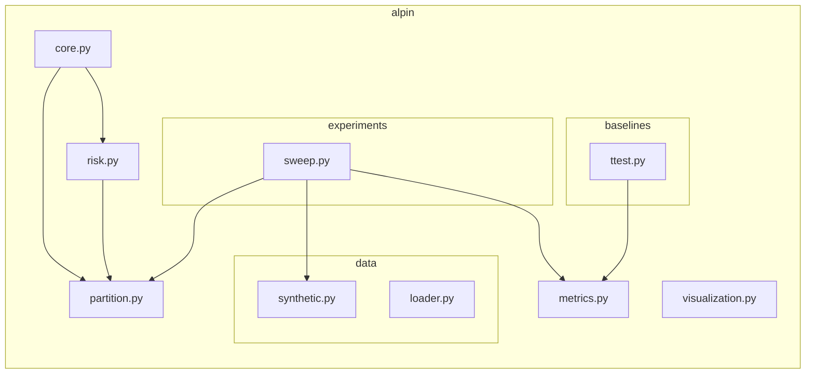

# Module Dependencies

This document describes the internal dependencies and relationships between the Python modules in the `alpin` package.

## Dependency Graph

## Module Descriptions

| Module | Responsibility | Key Dependencies |
|--------|----------------|------------------|
| **[[Modules/Core-ALPIN|core.py]]** | Main ALPIN class, fit/predict logic | `partition.py`, `risk.py`, `scipy.optimize` |
| **[[Modules/Partition|partition.py]]** | Pelt algorithm wrapper | `ruptures` |
| **[[Modules/Risk|risk.py]]** | Excess risk and penalized risk functions | `partition.py` |
| **[[Modules/Metrics|metrics.py]]** | Precision, Recall, Hausdorff, Rand Index | `sklearn.metrics` |
| **[[Modules/Visualization|visualization.py]]** | Matplotlib and Plotly plotting | `matplotlib`, `plotly` |
| **[[Modules/Data-Synthetic|data/synthetic.py]]** | Signal generation and DeepAR conversion | `numpy`, `pandas` |
| **[[Modules/Data-Loader|data/loader.py]]** | CSV loading protocols | `pandas`, `pathlib` |
| **[[Modules/Baselines-TTest|baselines/ttest.py]]** | T-test based changepoint detection | `scipy.stats` |
| **[[Modules/Experiments-Sweep|experiments/sweep.py]]** | Parameter and noise sweeps | `partition.py`, `metrics.py` |

## External Dependencies

The project relies on several key external libraries:
- **`numpy`**: Numerical computations.
- **`scipy`**: Optimization (L-BFGS-B) and statistical tests.
- **`ruptures`**: Efficient implementation of the Pelt algorithm.
- **`pytorch-forecasting`**: DeepAR implementation and time series datasets.
- **`pytorch-lightning`**: Training framework for DeepAR.
- **`pandas`**: Data manipulation and CSV handling.
- **`matplotlib` / `plotly`**: Static and interactive visualizations.
