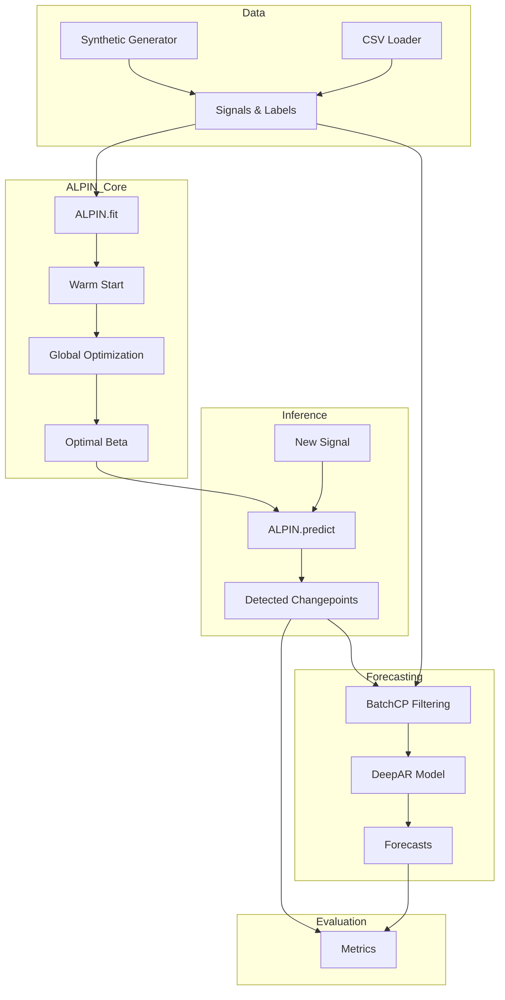

# Project Overview

The **ALPIN** (Adaptive Learning of Penalty for INference) project is a Python implementation of a supervised learning approach for changepoint detection. It focuses on automatically learning the optimal penalty parameter $\beta$ for the **Pelt** algorithm, which is used to segment piecewise-constant signals.

## Core Objectives

1. **Automated Parameter Tuning**: Eliminate the need for manual tuning of the penalty parameter $\beta$ in changepoint detection.
2. **Supervised Learning**: Use labeled training data (signals with known changepoints) to learn the best $\beta$.
3. **Forecasting Enhancement**: Integrate changepoint detection with time series forecasting (DeepAR) to improve accuracy by filtering out "contaminated" training batches.

## High-Level Architecture

The system is composed of several interconnected components:

## Key Components

- **[[Modules/Core-ALPIN|ALPIN Class]]**: The main entry point for training and prediction.
- **[[Algorithms/Optimal-Partition|Optimal Partition Solver]]**: Uses the `ruptures` library to solve the penalized risk minimization problem.
- **[[Algorithms/Risk-Minimization|Risk Estimation]]**: Computes the excess risk used as the loss function during optimization.
- **[[Algorithms/BatchCP-Filtering|BatchCP]]**: A method to improve forecasting by excluding training windows that contain changepoints.

## References

- T. Truong, C. Oriot, V. Lecomte. "Automatic labeling of piecewise-constant signals". EUSIPCO 2017.
- [[Architecture/DeepCAR-Architecture|DeepCAR Experiment Design]]
