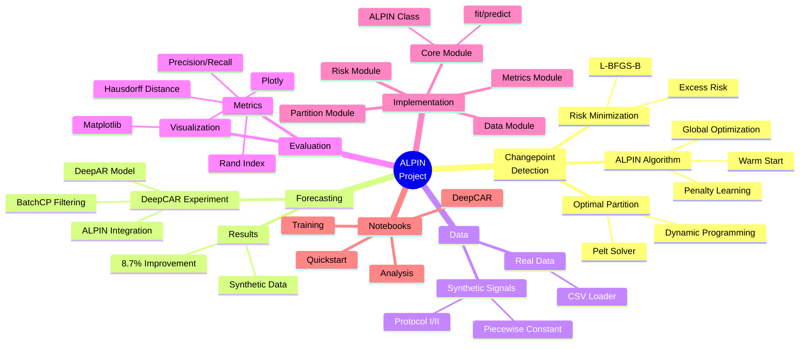

# ALPIN Project Documentation

Welcome to the comprehensive documentation for the **ALPIN** (Adaptive Learning of Penalty for INference) project. This vault provides detailed insights into the codebase, algorithms, and experiments.

## Project Mindmap

## Navigation

### 🏗️ [[Architecture/Project-Overview|Architecture]]
- [[Architecture/Project-Overview|Project Overview]]
- [[Architecture/Module-Dependencies|Module Dependencies]]
- [[Architecture/Data-Flow|Data Flow]]
- [[Architecture/DeepCAR-Architecture|DeepCAR Architecture]]

### 🧮 [[Algorithms/ALPIN-Algorithm|Algorithms]]
- [[Algorithms/ALPIN-Algorithm|ALPIN Algorithm]]
- [[Algorithms/Optimal-Partition|Optimal Partition (Pelt)]]
- [[Algorithms/Risk-Minimization|Risk Minimization]]
- [[Algorithms/BatchCP-Filtering|BatchCP Filtering]]

### 📦 [[Modules/Core-ALPIN|Modules]]
- [[Modules/Core-ALPIN|Core ALPIN]]
- [[Modules/Partition|Partition Solver]]
- [[Modules/Risk|Risk Estimation]]
- [[Modules/Metrics|Evaluation Metrics]]
- [[Modules/Visualization|Visualization]]
- [[Modules/Data-Synthetic|Synthetic Data]]
- [[Modules/Data-Loader|Data Loader]]
- [[Modules/Baselines-TTest|Baselines (T-Test)]]
- [[Modules/Experiments-Sweep|Experiments (Sweep)]]

### 📓 [[Notebooks/01-Quickstart-Guide|Notebooks]]
- [[Notebooks/01-Quickstart-Guide|01 Quickstart]]
- [[Notebooks/02-Training-Guide|02 Training]]
- [[Notebooks/03-Analysis-Guide|03 Analysis]]
- [[Notebooks/04-DeepCAR-Experiment|04 DeepCAR Experiment]]

### 📚 [[API-Reference/ALPIN-Class|API Reference]]
- [[API-Reference/ALPIN-Class|ALPIN Class]]
- [[API-Reference/Data-Functions|Data Functions]]
- [[API-Reference/Metrics-Functions|Metrics Functions]]
- [[API-Reference/Visualization-Functions|Visualization Functions]]

### 💡 [[Concepts/Changepoint-Detection|Concepts]]
- [[Concepts/Changepoint-Detection|Changepoint Detection]]
- [[Concepts/Penalty-Parameter|Penalty Parameter (β)]]
- [[Concepts/Excess-Risk|Excess Risk]]
- [[Concepts/Evaluation-Metrics|Evaluation Metrics]]
- [[Concepts/Time-Series-Forecasting|Time Series Forecasting]]

### 🎓 [[Tutorials/Getting-Started|Tutorials]]
- [[Tutorials/Getting-Started|Getting Started]]
- [[Tutorials/Training-ALPIN|Training ALPIN]]
- [[Tutorials/Making-Predictions|Making Predictions]]
- [[Tutorials/Running-DeepCAR|Running DeepCAR]]
